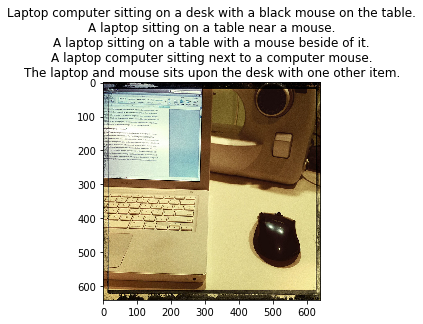
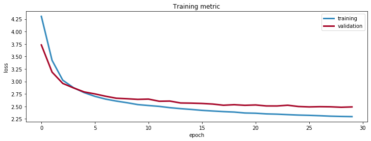
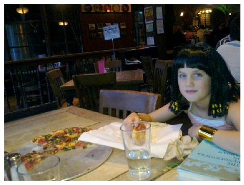
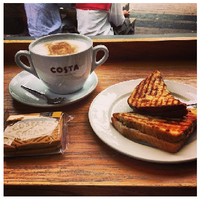
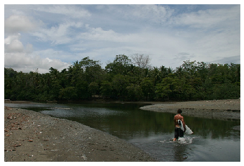
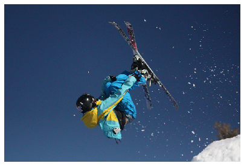
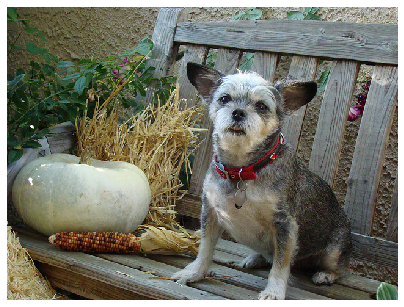
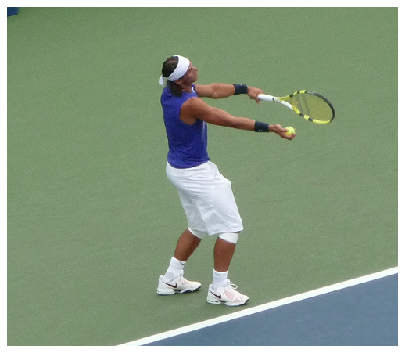
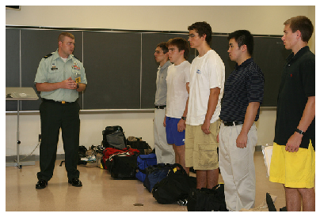
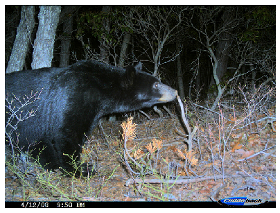

# Image Captioning

## Objectives

The objective of this project it to create a model to generate English captions for given images. Image captioning can be used to index images, generate automatic caption, and perform search on images using text as an input. This notebook presents the implemenation of a model combining a convolutional neural network structure and a recurent network structure.


Model architecture: CNN encoder and RNN decoder. 
(https://research.googleblog.com/2014/11/a-picture-is-worth-thousand-coherent.html)

## Metric

For this project, we will evaluate the performannces of our model based on the **accuracy** of the word predictions. Our model will be optimized using categorical **cross-entropy**.

## Module Import

Tensorflow is used to generate our model. This library provides enough flexibility to build a complex model combining various deep learning tools (NN, CNN, RNN...)


```python
import sys
sys.path.append("..")
import grading
import download_utils
```


```python
download_utils.link_all_keras_resources()
```


```python
import tensorflow as tf
from tensorflow.contrib import keras
import numpy as np
%matplotlib inline
import matplotlib.pyplot as plt
L = keras.layers
K = keras.backend
import utils
import time
import zipfile
import json
from collections import defaultdict
import re
import random
from random import choice
import grading_utils
import os
from keras_utils import reset_tf_session
import tqdm_utils
```


<p style="color: red;">
The default version of TensorFlow in Colab will soon switch to TensorFlow 2.x.<br>
We recommend you <a href="https://www.tensorflow.org/guide/migrate" target="_blank">upgrade</a> now 
or ensure your notebook will continue to use TensorFlow 1.x via the <code>%tensorflow_version 1.x</code> magic:
<a href="https://colab.research.google.com/notebooks/tensorflow_version.ipynb" target="_blank">more info</a>.</p>


    Using TensorFlow backend.


## Prepare the storage for model checkpoints

## Download data

The original data is obtained from the following sources:

- train images http://msvocds.blob.core.windows.net/coco2014/train2014.zip
- validation images http://msvocds.blob.core.windows.net/coco2014/val2014.zip
- captions for both train and validation http://msvocds.blob.core.windows.net/annotations-1-0-3/captions_train-val2014.zip
## Data Preparation and Encoding

In order to generate caption we use a model made of two blocks:

1. CNN: used to extract image features (based on the InceptionV3)
2. RNN: used to generate the captions
### Extract image features

We will use pre-trained InceptionV3 model for CNN encoder (https://research.googleblog.com/2016/03/train-your-own-image-classifier-with.html). The original InceptionV3 model contains a CNN network terminated by a MLP and a softmax function. Since our goal is to feed the image encoding to our RNN, we will not include the MLP layers.


```python
IMG_SIZE = 299
```

Here is a simple diagram of our image encoding. The pre-processing of the image is intended to transform the image to meet the format requirements of the InceptionV3.  


```python
# we take the last hidden layer of IncetionV3 as an image embedding
def get_cnn_encoder():

    # the keras learning phase adjust the behavior of certain functions during train time and test time
    K.set_learning_phase(False)

    # load InceptionV3 and remove dense layers
    model = keras.applications.InceptionV3(include_top=False)

    # load preprocess_input (this will be used to apply the necessary pre-processing to our images)
    preprocess_for_model = keras.applications.inception_v3.preprocess_input

    # define model:
    #   input: inputs for InceptionV3
    #   output: GlobalAveragePooling2D on InceptionV3 output
    #   full model: input -> preprocess InceptionV3 -> AveragePooling
    model = keras.models.Model(model.inputs, keras.layers.GlobalAveragePooling2D()(model.output))

    return model, preprocess_for_model
```

```python
# load pre-trained model
reset_tf_session()
encoder, preprocess_for_model = get_cnn_encoder()

# extract train features
train_img_embeds, train_img_fns = utils.apply_model(
    "train2014.zip", encoder, preprocess_for_model, input_shape=(IMG_SIZE, IMG_SIZE))
utils.save_pickle(train_img_embeds, "train_img_embeds.pickle")
utils.save_pickle(train_img_fns, "train_img_fns.pickle")

# extract validation features
val_img_embeds, val_img_fns = utils.apply_model(
    "val2014.zip", encoder, preprocess_for_model, input_shape=(IMG_SIZE, IMG_SIZE))
utils.save_pickle(val_img_embeds, "val_img_embeds.pickle")
utils.save_pickle(val_img_fns, "val_img_fns.pickle")

# sample images for learners
def sample_zip(fn_in, fn_out, rate=0.01, seed=42):
    np.random.seed(seed)
    with zipfile.ZipFile(fn_in) as fin, zipfile.ZipFile(fn_out, "w") as fout:
        sampled = filter(lambda _: np.random.rand() < rate, fin.filelist)
        for zInfo in sampled:
            fout.writestr(zInfo, fin.read(zInfo))
            
sample_zip("train2014.zip", "train2014_sample.zip")
sample_zip("val2014.zip", "val2014_sample.zip")
```


```python
# load prepared embeddings
train_img_embeds = utils.read_pickle("train_img_embeds.pickle")
train_img_fns = utils.read_pickle("train_img_fns.pickle")
val_img_embeds = utils.read_pickle("val_img_embeds.pickle")
val_img_fns = utils.read_pickle("val_img_fns.pickle")

# check shapes
print(train_img_embeds.shape, len(train_img_fns))
print(val_img_embeds.shape, len(val_img_fns))
```

    (82783, 2048) 82783
    (40504, 2048) 40504


```python
# check prepared samples of images
list(filter(lambda x: x.endswith("_sample.zip"), os.listdir(".")))
```


    ['val2014_sample.zip', 'train2014_sample.zip']


### Extract captions for images

Our file structure is set up as follows:  
1. `captions_train-val2014.zip` - zip file containing on folder `annotations`. This folder contains 2 json files.  
    a. `captions_train2014.json`  
    b. `captions_val2014.json`
2. `train2014_sample.zip` - contain a folder `train2014` which itself contains `jpg` images.
3. `val2014_sample.zip` - contain a folder `val2014` which itself contains `jpg` images.
4. `train_img_embeds.pickle` - batch outputs of our train set using the image encoder.
5. `train_img_fns.pickle` - list of strings containing file names of training set pictures.
6. `val_img_embeds.pickle` - batch outputs of our validation set using the image encoder.
7. `val_img_fns.pickle` - list of strings containing file names of validation set pictures.

Before we can perform any modeling, the datasets need to be prepared to be feed into our model. The first step consists of extracting file names and captions from our json files. The following function is used to create a list of file names and a corresponding list of lists of captions.


```python
# extract captions from zip
def get_captions_for_fns(fns, zip_fn, zip_json_path):
    # fns = list of image names (COCO_train2014_000000270070.jpg)
    # zip_fn = zip file
    # zip_json_path = json file path

    # create ZipFile object
    # contains two json files (train and validation)
    # json contains an image ID and a caption
    zf = zipfile.ZipFile(zip_fn)

    # load either train or validation json
    j = json.loads(zf.read(zip_json_path).decode("utf8"))

    # comprehension of images tags:
    # id for image id                'id': 391895
    # file_name for file name        'file_name': 'COCO_val2014_000000522418.jpg'
    # dictionary contains
    #   key = image_id
    #   value = file_name
    id_to_fn = {img["id"]: img["file_name"] for img in j["images"]}

    # use default dict to make it easier to compile several caption into one
    fn_to_caps = defaultdict(list)

    # annotations contains
    # image_id, id,  caption

    # dictionary contains
    #   key = image_id
    #   values = list of captions
    for cap in j['annotations']:
        fn_to_caps[id_to_fn[cap['image_id']]].append(cap['caption'])

    # convert to normal dictionary
    fn_to_caps = dict(fn_to_caps)

    # create a list of lists
    # smart ordering
    # the captions are retrieved based on the image order from fns
    return list(map(lambda x: fn_to_caps[x], fns))
    
train_captions = get_captions_for_fns(train_img_fns, "captions_train-val2014.zip", 
                                      "annotations/captions_train2014.json")

val_captions = get_captions_for_fns(val_img_fns, "captions_train-val2014.zip", 
                                      "annotations/captions_val2014.json")

# check shape
print('Captions in training set: {}'.format(len(train_img_fns)))
print('Captions in validation set: {}'.format(len(val_img_fns)))
```

    Captions in training set: 82783
    Captions in validation set: 40504


```python
# look at training example (each has 5 captions)
def show_trainig_example(train_img_fns, train_captions, example_idx=0):
    """
    You can change example_idx and see different images
    """

    # file containing all the images (training)
    zf = zipfile.ZipFile("train2014_sample.zip")

    # create dictionary: image name : image captions
    captions_by_file = dict(zip(train_img_fns, train_captions))

    # set of all the image files
    all_files = set(train_img_fns)

    # isolate selected file
    found_files = list(filter(lambda x: x.filename.rsplit("/")[-1] in all_files, zf.filelist))
    example = found_files[example_idx]

    # decode image corresponding to selected file
    img = utils.decode_image_from_buf(zf.read(example))
    
    # plot image and set captions as title
    plt.imshow(utils.image_center_crop(img))
    plt.title("\n".join(captions_by_file[example.filename.rsplit("/")[-1]]))
    plt.show()
    
show_trainig_example(train_img_fns, train_captions, example_idx=15)
```





### Prepare captions for training

Now that we have organized our images, we need to focus on the captions. Our captions are currently stored as list of strings. In order to be used in our RNN network, we will go through the following process:  
1. Generate a vocabulary list.
2. Add special encoding tokens:  
    a. padding  
    b. unknown word  
    c. start  
    d. end  
3. Use Word2Vec encoding on each caption. 


```python
# special tokens
PAD = "#PAD#"
UNK = "#UNK#"
START = "#START#"
END = "#END#"

def split_sentence(sentence):
    return list(filter(lambda x: len(x) > 0, re.split('\W+', sentence.lower())))

def generate_vocabulary(train_captions):
    """
    Return {token: index} for all train tokens (words) that occur 5 times or more, 
        `index` should be from 0 to N, where N is a number of unique tokens in the resulting dictionary.
    Use `split_sentence` function to split sentence into tokens.
    Also, add PAD (for batch padding), UNK (unknown, out of vocabulary), 
        START (start of sentence) and END (end of sentence) tokens into the vocabulary.
    """

    # vocab contains all the words which appear 5 times or more
    vocab = defaultdict(int)

    # create dictionary of "word": occurence_count
    for captions in train_captions:
        for caption in captions:
            for word in split_sentence(caption):
                vocab[word]+=1

    # filter vocab to only keep word with occurence >=5
    vocab_filter = {word:occur for word, occur in vocab.items() if occur>=5}

    # add special tokens
    vocab_filter[PAD] = 1
    vocab_filter[UNK] = 1
    vocab_filter[START] = 1
    vocab_filter[END] = 1

    return {token: index for index, token in enumerate(sorted(vocab_filter))}
    
def caption_tokens_to_indices(captions, vocab):
    """
    `captions` argument is an array of arrays:
    [
        [
            "image1 caption1",
            "image1 caption2",
            ...
        ],
        [
            "image2 caption1",
            "image2 caption2",
            ...
        ],
        ...
    ]
    Use `split_sentence` function to split sentence into tokens.
    Replace all tokens with vocabulary indices, use UNK for unknown words (out of vocabulary).
    Add START and END tokens to start and end of each sentence respectively.
    For the example above you should produce the following:
    [
        [
            [vocab[START], vocab["image1"], vocab["caption1"], vocab[END]],
            [vocab[START], vocab["image1"], vocab["caption2"], vocab[END]],
            ...
        ],
        ...
    ]
    """
    # results
    res = []

    # loop over captions
    for caption_group in captions:

        # save results for caption group
        caption_group_res = []

        for caption in caption_group:
            words = split_sentence(caption)
            word_index = list(map(vocab.get, words))
            
            # insert START and END TOKEN
            word_index.insert(0, vocab[START])
            word_index.append(vocab[END])

            # replace failed matches with UNKNOW
            word_index = [vocab[UNK] if idx == None else idx for idx in word_index]
            
            # save results
            caption_group_res.append(word_index)

        res.append(caption_group_res)

    return res
```


```python
# prepare vocabulary
vocab = generate_vocabulary(train_captions)
vocab_inverse = {idx: w for w, idx in vocab.items()}
print('Vocabulary size: {}'.format(len(vocab)))
```

    Vocabulary size: 8769


```python
# replace tokens with indices
train_captions_indexed = caption_tokens_to_indices(train_captions, vocab)
val_captions_indexed = caption_tokens_to_indices(val_captions, vocab)
```


```python
print('Word2Vec example:')
print('   caption:',train_captions[0][0])
print('   tokenized caption:',train_captions_indexed[0][0])
decoded = [vocab_inverse[idx] for idx in train_captions_indexed[0][0]]
print('   decoded caption:', decoded)
```

    Word2Vec example:
       caption: A long dirt road going through a forest.
       tokenized caption: [2, 54, 4462, 2305, 6328, 3354, 7848, 54, 3107, 0]
       decoded caption: ['#START#', 'a', 'long', 'dirt', 'road', 'going', 'through', 'a', 'forest', '#END#']


Captions have different length, but we need to batch them, that's why we will add PAD tokens so that all sentences have an equal length. 

Note: Padding tokens are ignore in the loss calculation.


```python
# we will use this during training
def batch_captions_to_matrix(batch_captions, pad_idx, max_len=None):
    """
    `batch_captions` is an array of arrays:
    [
        [vocab[START], ..., vocab[END]],
        [vocab[START], ..., vocab[END]],
        ...
    ]
    Put vocabulary indexed captions into np.array of shape (len(batch_captions), columns),
        where "columns" is max(map(len, batch_captions)) when max_len is None
        and "columns" = min(max_len, max(map(len, batch_captions))) otherwise.

    Add padding with pad_idx where necessary.
    Input example: [[1, 2, 3], [4, 5]]
    Output example: np.array([[1, 2, 3], [4, 5, pad_idx]]) if max_len=None
    Output example: np.array([[1, 2], [4, 5]]) if max_len=2
    Output example: np.array([[1, 2, 3], [4, 5, pad_idx]]) if max_len=100
    Try to use numpy, we need this function to be fast!
    """
    # find max len
    if max_len is None:
        max_len = max(map(len, batch_captions))
    else:
        max_len = min(max_len, max(map(len, batch_captions)))

    # create result matrix
    matrix = np.full((len(batch_captions), max_len), fill_value=pad_idx, dtype=int)
    
    # fill matrix
    for caption_idx in range(len(batch_captions)):
        for word_idx in range(len(batch_captions[caption_idx])):

            # fill if word_idx <= max_len - 1
            if word_idx >= max_len:
                break
            else:
                matrix[caption_idx, word_idx] = batch_captions[caption_idx][word_idx]

    return matrix
```

# Model

## Define architecture

The image encoding produced by the CNN is used as an input to our RNN model in addition to the captions. In other words, to predict the k-th word of a caption, we use the image encoding and the (k-1) first words as an input.


In order to start building our architecture, we need to ensure shape compatibility at the junction of our two modules (CNN and RNN).


```python
print("output shape of the image encoder:, (?,{})".format(train_img_embeds.shape[1]))
```

    output shape of the image encoder:, (?,2048)


As shown above, the image encoder currently outputs a vector of size 2048 for each image. This vector size is too large for typical models, we will therefore insert a bottleneck block between the CNN and the RNN.  
  
In addition, word embedding is also used to convey word meaning into our LSTM model.

Therefore, the following steps must be taken:

**Images:**  
1. Pass encoded image into bottleneck.
2. Pass bottleneck output into a dense layer so output is expanded to match LSTM size.
3. Feed bottleneck output into an LSTM cell.

**Captions:**  
1. Pass Word2Vec structure into a word embedding layer.
2. Feed embedding into LSTM cell.
3. Pass LSTM output into a Dense layer
4. Predict next word of caption.


```python
IMG_EMBED_SIZE = train_img_embeds.shape[1]      # training image size (2048) stored in [None, IMG_EMBED_SIZE] array (images after passing through network minus last layer)
IMG_EMBED_BOTTLENECK = 120                      # dimension used for the bottleneck reduction from the embedded images 2048 -> 120
WORD_EMBED_SIZE = 100                           # word embedding after LSTM
LSTM_UNITS = 300                                # numer of units for LSTM layer
LOGIT_BOTTLENECK = 120                          # bottleneck output of LSTM
pad_idx = vocab[PAD]                            # index of #PAD# tag

# print info
print("IMG_EMBED_SIZE \t\t", IMG_EMBED_SIZE)
print("IMG_EMBED_BOTTLENECK\t", IMG_EMBED_BOTTLENECK)
print("WORD_EMBED_SIZE\t\t", WORD_EMBED_SIZE)
print("LSTM_UNITS\t\t", LSTM_UNITS)
print("LOGIT_BOTTLENECK\t", LOGIT_BOTTLENECK)
```

    IMG_EMBED_SIZE 		 2048
    IMG_EMBED_BOTTLENECK	 120
    WORD_EMBED_SIZE		 100
    LSTM_UNITS		 300
    LOGIT_BOTTLENECK	 120


```python
# remember to reset your graph if you want to start building it from scratch!
s = reset_tf_session()
tf.set_random_seed(42)
```

    WARNING:tensorflow:From /content/keras_utils.py:68: The name tf.get_default_session is deprecated. Please use tf.compat.v1.get_default_session instead.
    
    WARNING:tensorflow:From /usr/local/lib/python3.6/dist-packages/keras/backend/tensorflow_backend.py:79: The name tf.reset_default_graph is deprecated. Please use tf.compat.v1.reset_default_graph instead.
    
    WARNING:tensorflow:From /usr/local/lib/python3.6/dist-packages/keras/backend/tensorflow_backend.py:82: The name tf.placeholder is deprecated. Please use tf.compat.v1.placeholder instead.
    
    WARNING:tensorflow:From /usr/local/lib/python3.6/dist-packages/keras/backend/tensorflow_backend.py:84: The name tf.get_default_graph is deprecated. Please use tf.compat.v1.get_default_graph instead.
    
    WARNING:tensorflow:From /content/keras_utils.py:75: The name tf.ConfigProto is deprecated. Please use tf.compat.v1.ConfigProto instead.
    
    WARNING:tensorflow:From /content/keras_utils.py:77: The name tf.InteractiveSession is deprecated. Please use tf.compat.v1.InteractiveSession instead.
    


Here's a figure to help you with flattening in decoder:  


```python
LOG_DIR = './logs'
get_ipython().system_raw(
    'tensorboard --logdir {} --host 0.0.0.0 --port 6006 &'
    .format(LOG_DIR)
)
# Install
! npm install -g localtunnel

!rm url.txt
!rm -r logs

# Tunnel port 6006 (TensorBoard assumed running)
get_ipython().system_raw('lt --port 6006 >> url.txt 2>&1 &')

# Get url
! cat url.txt
```

    [?25h/tools/node/bin/lt -> /tools/node/lib/node_modules/localtunnel/bin/lt.js
    [?25h+ localtunnel@2.0.0
    added 35 packages from 21 contributors in 2.332s
    rm: cannot remove 'url.txt': No such file or directory
    rm: cannot remove 'logs': No such file or directory
    your url is: https://nervous-dingo-17.localtunnel.me


```python
class decoder:

    ############
    # IMAGES
    ############

    # encoding -> bottleneck -> reshape for RNN

    # start with encoded images
    # [batch_size, IMG_EMBED_SIZE] of CNN image features
    img_embeds = tf.placeholder('float32', [None, IMG_EMBED_SIZE],name='img_embeds')

    # we use bottleneck here to reduce the number of parameters
    # image embedding -> bottleneck
    img_embed_to_bottleneck = L.Dense(IMG_EMBED_BOTTLENECK, 
                                      input_shape=(None, IMG_EMBED_SIZE), 
                                      activation='elu',
                                      name='img_embed_to_bottleneck')
    
    # image embedding bottleneck -> lstm initial state
    img_embed_bottleneck_to_h0 = L.Dense(LSTM_UNITS,
                                         input_shape=(None, IMG_EMBED_BOTTLENECK),
                                         activation='elu',
                                         name='img_embed_bottleneck_to_h0')
    
    ############
    # WORDS
    ############

    # [batch_size, time steps] of word ids
    sentences = tf.placeholder('int32', [None, None], name='sentences')

    # word -> embedding
    # size: len(vocab) x WORD_EMBED_SIZE
    word_embed = L.Embedding(len(vocab), WORD_EMBED_SIZE, name='word_embed')

    # lstm cell (from tensorflow)
    lstm = tf.nn.rnn_cell.LSTMCell(LSTM_UNITS)
    
    # we use bottleneck here to reduce model complexity
    # lstm output -> logits bottleneck
    token_logits_bottleneck = L.Dense(LOGIT_BOTTLENECK, 
                                      input_shape=(None, LSTM_UNITS),
                                      activation="elu",
                                      name='token_logits_bottleneck')
    
    # logits bottleneck -> logits for next token prediction
    token_logits = L.Dense(len(vocab),
                           input_shape=(None, LOGIT_BOTTLENECK),
                           name='token_logits')
    
    # initial lstm cell state of shape (None, LSTM_UNITS),
    # we need to condition it on `img_embeds` placeholder.
    c0 = h0 = img_embed_bottleneck_to_h0(img_embed_to_bottleneck(img_embeds))
    # c0 = hidden state 0
    # h0 = output 0

    # embed all tokens but the last for lstm input,
    # remember that L.Embedding is callable,
    # use `sentences` placeholder as input.
    word_embeds = word_embed(sentences[:,:-1])
    
    # during training we use ground truth tokens `word_embeds` as context for next token prediction.
    # that means that we know all the inputs for our lstm and can get 
    # all the hidden states with one tensorflow operation (tf.nn.dynamic_rnn).
    # `hidden_states` has a shape of [batch_size, time steps, LSTM_UNITS].
    # the final output is not used.
    hidden_states, _ = tf.nn.dynamic_rnn(cell=lstm, inputs=word_embeds,
                                         initial_state=tf.nn.rnn_cell.LSTMStateTuple(c0, h0))
    # tf.nn.rnn_cell.LSTMStateTuple takes two input:
    # Tuple used by LSTM Cells for `state_size`, `zero_state`, and output state.

    # now we need to calculate token logits for all the hidden states
    
    # first, we reshape `hidden_states` to [-1, LSTM_UNITS]
    # current hidden stats are: [batch_size, time steps, LSTM_UNITS]
    flat_hidden_states = tf.reshape(hidden_states, shape=[-1, LSTM_UNITS], name='flat_hidden_states')

    # then, we calculate logits for next tokens using `token_logits_bottleneck` and `token_logits` layers
    # Step 1: take flat_hidden_states and pass them into the token_logits_bottleneck
    # Step 2: take the output and pass into token_logits
    flat_token_logits = token_logits(token_logits_bottleneck(flat_hidden_states))
    
    # then, we flatten the ground truth token ids.
    # remember, that we predict next tokens for each time step,
    # use `sentences` placeholder.
    flat_ground_truth = tf.reshape(sentences[:,1:], [-1], name='flat_ground_truth')

    # we need to know where we have real tokens (not padding) in `flat_ground_truth`,
    # we don't want to propagate the loss for padded output tokens,
    # fill `flat_loss_mask` with 1.0 for real tokens (not pad_idx) and 0.0 otherwise.
    flat_loss_mask = tf.cast(tf.not_equal(flat_ground_truth, pad_idx), dtype=tf.float32, name='flat_loss_mask')

    # compute cross-entropy between `flat_ground_truth` and `flat_token_logits` predicted by lstm
    xent = tf.nn.sparse_softmax_cross_entropy_with_logits(
        labels=flat_ground_truth, 
        logits=flat_token_logits
    )

    # compute average `xent` over tokens with nonzero `flat_loss_mask`.
    # we don't want to account misclassification of PAD tokens, because that doesn't make sense,
    # we have PAD tokens for batching purposes only!
    loss = tf.reduce_sum(tf.multiply(xent, flat_loss_mask))/tf.reduce_sum(flat_loss_mask)
```

    WARNING:tensorflow:From /usr/local/lib/python3.6/dist-packages/tensorflow_core/python/keras/initializers.py:119: calling RandomUniform.__init__ (from tensorflow.python.ops.init_ops) with dtype is deprecated and will be removed in a future version.
    Instructions for updating:
    Call initializer instance with the dtype argument instead of passing it to the constructor
    WARNING:tensorflow:From <ipython-input-23-8c0cb10ac10c>:38: LSTMCell.__init__ (from tensorflow.python.ops.rnn_cell_impl) is deprecated and will be removed in a future version.
    Instructions for updating:
    This class is equivalent as tf.keras.layers.LSTMCell, and will be replaced by that in Tensorflow 2.0.
    WARNING:tensorflow:From /usr/local/lib/python3.6/dist-packages/tensorflow_core/python/ops/resource_variable_ops.py:1630: calling BaseResourceVariable.__init__ (from tensorflow.python.ops.resource_variable_ops) with constraint is deprecated and will be removed in a future version.
    Instructions for updating:
    If using Keras pass *_constraint arguments to layers.
    WARNING:tensorflow:From <ipython-input-23-8c0cb10ac10c>:69: dynamic_rnn (from tensorflow.python.ops.rnn) is deprecated and will be removed in a future version.
    Instructions for updating:
    Please use `keras.layers.RNN(cell)`, which is equivalent to this API
    WARNING:tensorflow:From /usr/local/lib/python3.6/dist-packages/tensorflow_core/python/ops/rnn_cell_impl.py:958: Layer.add_variable (from tensorflow.python.keras.engine.base_layer) is deprecated and will be removed in a future version.
    Instructions for updating:
    Please use `layer.add_weight` method instead.
    WARNING:tensorflow:From /usr/local/lib/python3.6/dist-packages/tensorflow_core/python/ops/rnn_cell_impl.py:962: calling Zeros.__init__ (from tensorflow.python.ops.init_ops) with dtype is deprecated and will be removed in a future version.
    Instructions for updating:
    Call initializer instance with the dtype argument instead of passing it to the constructor


```python
# define optimizer operation to minimize the loss
optimizer = tf.train.AdamOptimizer(learning_rate=0.001)
train_step = optimizer.minimize(decoder.loss)

# will be used to save/load network weights.
# you need to reset your default graph and define it in the same way to be able to load the saved weights!
saver = tf.train.Saver()

# intialize all variables
s.run(tf.global_variables_initializer())
```


```python
writer = tf.summary.FileWriter('./logs', s.graph)
```


## Training loop
  
Before we can train the model, we need to generate our training and validation batches. Each batch contains a set of embedded images (from the InceptionV3 encoder) and indexed captions.  
- 


```python
train_captions_indexed = np.array(train_captions_indexed)
val_captions_indexed = np.array(val_captions_indexed)
```


```python
# generate batch via random sampling of images and captions,
# we use `max_len` parameter to control the length of the captions (truncating long captions)
def generate_batch(images_embeddings, indexed_captions, batch_size, max_len=None):
    """
    `images_embeddings` is a np.array of shape [number of images, IMG_EMBED_SIZE].
    `indexed_captions` holds 5 vocabulary indexed captions for each image:
    [
        [
            [vocab[START], vocab["image1"], vocab["caption1"], vocab[END]],
            [vocab[START], vocab["image1"], vocab["caption2"], vocab[END]],
            ...
        ],
        ...
    ]
    Generate a random batch of size `batch_size`.
    Take random images and choose one random caption for each image.
    Remember to use `batch_captions_to_matrix` for padding and respect `max_len` parameter.
    Return feed dict {decoder.img_embeds: ..., decoder.sentences: ...}.
    """
    batch_image_embeddings = list()
    batch_captions_matrix = list()

    for idx in range(batch_size):

        # select a random image
        img_idx = np.random.choice(images_embeddings.shape[0])
        batch_image_embeddings.append(images_embeddings[img_idx])

        # select a random caption amongst the 5 for each images
        caption_idx = np.random.choice(5)
        batch_captions_matrix.append(indexed_captions[img_idx][caption_idx])

    # pad the batch if necessary
    batch_captions_matrix = batch_captions_to_matrix(batch_captions_matrix, pad_idx, max_len)
    
    return {decoder.img_embeds: batch_image_embeddings, 
            decoder.sentences: batch_captions_matrix}
```


```python
batch_size = 64
n_epochs = 30
n_batches_per_epoch = 1000
n_validation_batches = 100  # how many batches are used for validation after each epoch
```


```python
# you can load trained weights here
# uncomment the next line if you need to load weights
# saver.restore(s, get_checkpoint_path(epoch=4))
```

Look at the training and validation loss, they should be decreasing!


```python
# actual training loop
MAX_LEN = 20  # truncate long captions to speed up training

# to make training reproducible
np.random.seed(42)
random.seed(42)

losses_train = [] 
losses_val = []

# loop over n_epochs
for epoch in range(n_epochs):
    
    # set loss to 0
    train_loss = 0
    pbar = tqdm_utils.tqdm_notebook_failsafe(range(n_batches_per_epoch))
    counter = 0
    for _ in pbar:

        # run optimizer and save loss
        # genenrate batch
        train_loss += s.run([decoder.loss, train_step], 
                            generate_batch(train_img_embeds, 
                                           train_captions_indexed, 
                                           batch_size, 
                                           MAX_LEN))[0]
        # couter to average the loss
        counter += 1
        pbar.set_description("Training loss: %f" % (train_loss / counter))
    
    # average loss per epochs
    train_loss /= n_batches_per_epoch
    
    # set validation loss = 0
    val_loss = 0

    # perform validation over n_validation_batches
    for _ in range(n_validation_batches):
        val_loss += s.run(decoder.loss, generate_batch(val_img_embeds,
                                                       val_captions_indexed, 
                                                       batch_size, 
                                                       MAX_LEN))
    val_loss /= n_validation_batches
    
    losses_train.append(train_loss)
    losses_val.append(val_loss)
    print('Epoch: {}, train loss: {}, val loss: {}'.format(epoch, train_loss, val_loss))

    # save weights after finishing epoch
    saver.save(s, get_checkpoint_path(epoch))
    
print("Finished!")
```

    **************************************************
    Training loss: 4.304580
    Epoch: 0, train loss: 4.304580224990845, val loss: 3.7320654726028444
    **************************************************
    Training loss: 3.423155
    Epoch: 1, train loss: 3.423154556274414, val loss: 3.1873935198783876
    **************************************************
    Training loss: 3.025284
    Epoch: 2, train loss: 3.0252837190628052, val loss: 2.9603699707984923
    **************************************************
    Training loss: 2.874783
    Epoch: 3, train loss: 2.8747830657958984, val loss: 2.870602424144745
    **************************************************
    Training loss: 2.775481
    Epoch: 4, train loss: 2.7754814348220824, val loss: 2.789423477649689
    **************************************************
    Training loss: 2.701144
    Epoch: 5, train loss: 2.701143687963486, val loss: 2.749979841709137
    WARNING:tensorflow:From /usr/local/lib/python3.6/dist-packages/tensorflow_core/python/training/saver.py:963: remove_checkpoint (from tensorflow.python.training.checkpoint_management) is deprecated and will be removed in a future version.
    Instructions for updating:
    Use standard file APIs to delete files with this prefix.
    **************************************************
    Training loss: 2.645951
    Epoch: 6, train loss: 2.645950514793396, val loss: 2.7031424283981322
    **************************************************
    Training loss: 2.606195
    Epoch: 7, train loss: 2.606195085763931, val loss: 2.6634791040420533
    **************************************************
    Training loss: 2.573536
    Epoch: 8, train loss: 2.5735364294052125, val loss: 2.652997634410858
    **************************************************
    Training loss: 2.536031
    Epoch: 9, train loss: 2.536031443834305, val loss: 2.6406166887283327
    **************************************************
    Training loss: 2.517448
    Epoch: 10, train loss: 2.517448023319244, val loss: 2.6462294101715087
    **************************************************
    Training loss: 2.500151
    Epoch: 11, train loss: 2.50015096616745, val loss: 2.603032250404358
    **************************************************
    Training loss: 2.474091
    Epoch: 12, train loss: 2.474090936422348, val loss: 2.6064940333366393
    **************************************************
    Training loss: 2.454694
    Epoch: 13, train loss: 2.4546935455799104, val loss: 2.5683004093170165
    **************************************************
    Training loss: 2.438749
    Epoch: 14, train loss: 2.4387487576007842, val loss: 2.5649581503868104
    **************************************************
    Training loss: 2.420365
    Epoch: 15, train loss: 2.420364526987076, val loss: 2.5585679984092713
    **************************************************
    Training loss: 2.407471
    Epoch: 16, train loss: 2.407471377849579, val loss: 2.5467315411567686
    **************************************************
    Training loss: 2.395392
    Epoch: 17, train loss: 2.3953915696144104, val loss: 2.523040156364441
    **************************************************
    Training loss: 2.386266
    Epoch: 18, train loss: 2.3862663419246672, val loss: 2.5338460755348207
    **************************************************
    Training loss: 2.367717
    Epoch: 19, train loss: 2.3677170577049256, val loss: 2.521715567111969
    **************************************************
    Training loss: 2.362852
    Epoch: 20, train loss: 2.3628519823551177, val loss: 2.528599863052368
    **************************************************
    Training loss: 2.349724
    Epoch: 21, train loss: 2.349724320650101, val loss: 2.508955328464508
    **************************************************
    Training loss: 2.344105
    Epoch: 22, train loss: 2.344105479001999, val loss: 2.5082675886154173
    **************************************************
    Training loss: 2.334501
    Epoch: 23, train loss: 2.334501156330109, val loss: 2.5232016921043394
    **************************************************
    Training loss: 2.325773
    Epoch: 24, train loss: 2.3257727496623994, val loss: 2.497510917186737
    **************************************************
    Training loss: 2.320536
    Epoch: 25, train loss: 2.320536171793938, val loss: 2.4894205212593077
    **************************************************
    Training loss: 2.312937
    Epoch: 26, train loss: 2.3129370038509367, val loss: 2.4940505599975586
    **************************************************
    Training loss: 2.303621
    Epoch: 27, train loss: 2.3036206084489823, val loss: 2.49146288394928
    **************************************************
    Training loss: 2.298418
    Epoch: 28, train loss: 2.2984176824092866, val loss: 2.4823158597946167
    **************************************************
    Training loss: 2.295024
    Epoch: 29, train loss: 2.2950236924886704, val loss: 2.4892579102516175
    Finished!


```python
colors = ['#348ABD', '#A60628']
epochs = np.arange(n_epochs)
losses = [losses_train, losses_val] 

plt.figure(figsize=(12,4))
plt.plot(epochs, losses[0], lw=3, color=colors[0], label='training')
plt.plot(epochs, losses[1], lw=3, color=colors[1], label='validation')

plt.legend()
plt.ylabel('loss')
plt.xlabel('epoch')
plt.title('Training metric');
```





After approximately 20 epochs, the validation loss starts to plateau. The gap between the training loss and validation loss increases and it is therefore a good decision to stop the learning at around 30 epochs. This will prevent overfitting the training set.  
  
With our newly trained model, we can now start making predictions.


```python
# check that it's learnt something, outputs accuracy of next word prediction (should be around 0.5)
from sklearn.metrics import accuracy_score, log_loss

# create sentence based on word mapping
def decode_sentence(sentence_indices):
    return " ".join(list(map(vocab_inverse.get, sentence_indices)))

def check_after_training(n_examples):
    # create batches
    fd = generate_batch(train_img_embeds, train_captions_indexed, batch_size)

    # flatten token and pass sentence through netowrk
    logits = decoder.flat_token_logits.eval(fd)
    truth = decoder.flat_ground_truth.eval(fd)
    mask = decoder.flat_loss_mask.eval(fd).astype(bool)

    # compute loss and accuracy
    print("Loss:", decoder.loss.eval(fd))
    print("Accuracy:", accuracy_score(logits.argmax(axis=1)[mask], truth[mask]))
    print()

    # display prediction for n random examples
    for example_idx in range(n_examples):
        print("Example", example_idx)
        print("Predicted:", decode_sentence(logits.argmax(axis=1).reshape((batch_size, -1))[example_idx]))
        print("Truth:", decode_sentence(truth.reshape((batch_size, -1))[example_idx]))
        print("")

check_after_training(3)
```

    Loss: 2.2630808
    Accuracy: 0.4940867279894875
    
    Example 0
    Predicted: a bike group of bicycles parked in to each building #END# #END# #END# #END# #END# #END# #END# #END# #END# #END# #END# #END# #END#
    Truth: a large group of bikes parked next to a building #END# #PAD# #PAD# #PAD# #PAD# #PAD# #PAD# #PAD# #PAD# #PAD# #PAD# #PAD# #PAD#
    
    Example 1
    Predicted: a kitchen kitchen with with appliances and and utensils #END# #END# #END# #END# #END# #END# #END# #END# #END# #END# #END# #END# #END# #END#
    Truth: a white kitchen filled with pots pans and dishes #END# #PAD# #PAD# #PAD# #PAD# #PAD# #PAD# #PAD# #PAD# #PAD# #PAD# #PAD# #PAD# #PAD#
    
    Example 2
    Predicted: a adult zebra is a younger zebra in a of a zebra #END# a zoo #END# #END# #END# #END# #END# #END# #END# #END#
    Truth: an older zebra and a younger one in front of a lake at a zoo #END# #PAD# #PAD# #PAD# #PAD# #PAD# #PAD# #PAD#
    


```python
# save last graph weights to file!
saver.save(s, get_checkpoint_path())
```


    '/content/gdrive/My Drive/colab/weights'


# Applying model

Now that we have trained our model, we need to adjust its structure to make predictions. We will keep the weights obtained during training and adjust the behavior so that the model predicts one word at a time and uses the first k words to predict word (k+1).

It will work as follows:
- take an image as an input and embed it
- condition lstm on that embedding
- predict the next token given a START input token
- use predicted token as an input at next time step
- iterate until you predict an END token


```python
class final_model:
    # CNN encoder
    encoder, preprocess_for_model = get_cnn_encoder()
    saver.restore(s, get_checkpoint_path())  # keras applications corrupt our graph, so we restore trained weights
    
    # containers for current lstm state
    lstm_c = tf.Variable(tf.zeros([1, LSTM_UNITS]), name="cell")
    lstm_h = tf.Variable(tf.zeros([1, LSTM_UNITS]), name="hidden")

    # input images
    input_images = tf.placeholder('float32', [1, IMG_SIZE, IMG_SIZE, 3], name='images')

    # get image embeddings
    img_embeds = encoder(input_images)

    # initialize lstm state conditioned on image
    init_c = init_h = decoder.img_embed_bottleneck_to_h0(decoder.img_embed_to_bottleneck(img_embeds))
    init_lstm = tf.assign(lstm_c, init_c), tf.assign(lstm_h, init_h)
    
    # current word index
    current_word = tf.placeholder('int32', [1], name='current_input')

    # embedding for current word
    word_embed = decoder.word_embed(current_word)

    # apply lstm cell, get new lstm states
    new_c, new_h = decoder.lstm(word_embed, tf.nn.rnn_cell.LSTMStateTuple(lstm_c, lstm_h))[1]

    # compute logits for next token
    new_logits = decoder.token_logits(decoder.token_logits_bottleneck(new_h))
    
    # compute probabilities for next token
    new_probs = tf.nn.softmax(new_logits)

    # `one_step` outputs probabilities of next token and updates lstm hidden state
    one_step = new_probs, tf.assign(lstm_c, new_c), tf.assign(lstm_h, new_h)
```

    INFO:tensorflow:Restoring parameters from /content/gdrive/My Drive/colab/weights


```python
# look at how temperature works for probability distributions
# for high temperature we have more uniform distribution
_ = np.array([0.5, 0.4, 0.1])
for t in [0.01, 0.1, 1, 10, 100]:
    print(" ".join(map(str, _**(1/t) / np.sum(_**(1/t)))), "with temperature", t)
```

    0.9999999997962965 2.0370359759195462e-10 1.2676505999700117e-70 with temperature 0.01
    0.9030370433250645 0.09696286420394223 9.247099323648666e-08 with temperature 0.1
    0.5 0.4 0.1 with temperature 1
    0.35344772639219624 0.34564811360592396 0.3009041600018798 with temperature 10
    0.33536728048099185 0.33461976434857876 0.3300129551704294 with temperature 100


```python
# this is an actual prediction loop
def generate_caption(image, t=1, sample=False, max_len=20):
    """
    Generate caption for given image.
    if `sample` is True, we will sample next token from predicted probability distribution.
    `t` is a temperature during that sampling,
        higher `t` causes more uniform-like distribution = more chaos.
    """
    # condition lstm on the image
    s.run(final_model.init_lstm, 
          {final_model.input_images: [image]})
    
    # current caption
    # start with only START token
    caption = [vocab[START]]
    
    for _ in range(max_len):
        next_word_probs = s.run(final_model.one_step, 
                                {final_model.current_word: [caption[-1]]})[0]
        next_word_probs = next_word_probs.ravel()
        
        # apply temperature
        next_word_probs = next_word_probs**(1/t) / np.sum(next_word_probs**(1/t))

        if sample:
            next_word = np.random.choice(range(len(vocab)), p=next_word_probs)
        else:
            next_word = np.argmax(next_word_probs)

        caption.append(next_word)
        if next_word == vocab[END]:
            break
       
    return list(map(vocab_inverse.get, caption))
```


```python
# look at validation prediction example
def apply_model_to_image_raw_bytes(raw):
    img = utils.decode_image_from_buf(raw)
    fig = plt.figure(figsize=(7, 7))
    plt.grid('off')
    plt.axis('off')
    plt.imshow(img)
    img = utils.crop_and_preprocess(img, (IMG_SIZE, IMG_SIZE), final_model.preprocess_for_model)
    print(' '.join(generate_caption(img)[1:-1]))
    plt.show()

def show_valid_example(val_img_fns, example_idx=0):
    zf = zipfile.ZipFile("val2014_sample.zip")
    all_files = set(val_img_fns)
    found_files = list(filter(lambda x: x.filename.rsplit("/")[-1] in all_files, zf.filelist))
    example = found_files[example_idx]
    apply_model_to_image_raw_bytes(zf.read(example))
    
show_valid_example(val_img_fns, example_idx=100)
```

    a baseball player is swinging at a pitch


```python
# sample more images from validation
for idx in np.random.choice(range(len(zipfile.ZipFile("val2014_sample.zip").filelist) - 1), 10):
    show_valid_example(val_img_fns, example_idx=idx)
    time.sleep(1)
```

    a group of people standing around a table with a cake


    a woman sitting at a table with a plate of food





    a plate with a sandwich and a cup of coffee on it





    a man and a woman on a boat on a river





    a group of people riding skis down a snow covered slope





    a dog is eating a banana with a toy





    a man is playing tennis on a court





    a group of people standing in a room with a remote





    a black bear is standing in the woods





    a pizza with cheese and toppings on a plate


